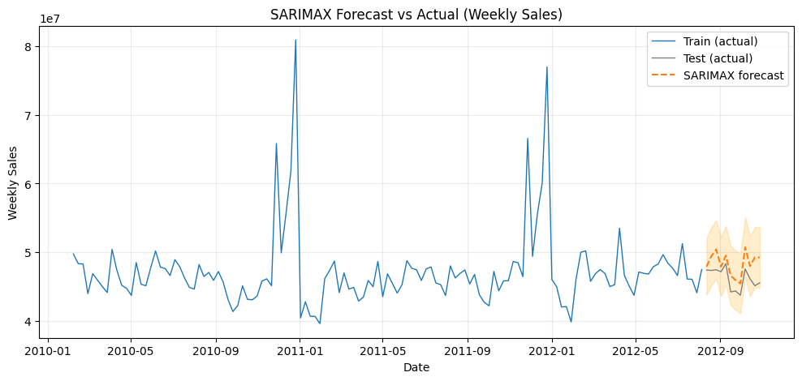
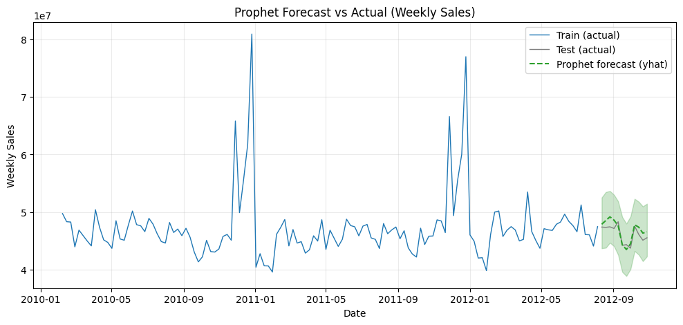
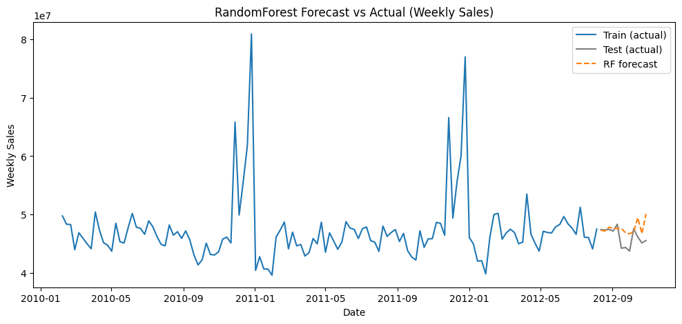
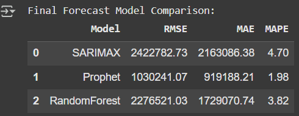

# Academic Project – Walmart Sales Forecasting

This project predicts Walmart’s weekly sales using multiple forecasting models as part of my academic portfolio.  

## Models Used
- SARIMAX (Statistical model)
- Prophet (Time-series forecasting by Facebook)
- RandomForest Regressor (Machine Learning)

## Results

| Model        | RMSE       | MAE        | MAPE   |
|--------------|-----------:|-----------:|-------:|
| SARIMAX      | 2,422,782  | 2,163,086  | 4.70%  |
| Prophet      | 1,030,241  |   919,188  | 1.98%  |
| RandomForest | 2,276,521  | 1,729,070  | 3.82%  |

Prophet outperformed other models with the lowest error, making it the most suitable for retail sales forecasting.

## Sample Visuals
## Forecast Results

### SARIMAX Forecast

### Prophet Forecast

### RandomForest Forecast

### Model Comparison

## Conclusion
- Prophet achieved the best accuracy (MAPE ≈ 2%).  
- RandomForest worked well as a baseline ML model.  
- SARIMAX struggled with complex seasonality.  

